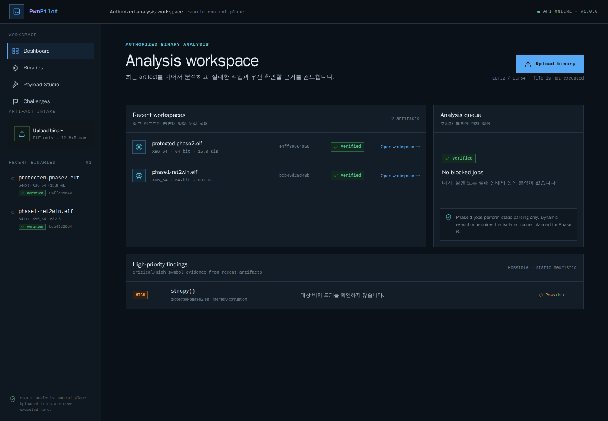

<div align="center">

# PwnPilot

**교육·CTF·허가된 바이너리를 위한 웹 기반 Pwnable 분석 워크스페이스**

[](https://github.com/MintKangaroo/Pwnable_Lab/actions/workflows/ci.yml)


</div>

PwnPilot은 ELF 구조와 보호 기법, 공격 표면, 디스어셈블리, ROP 재료를 한 Workspace에서
검토하는 교육용 분석 플랫폼입니다. 현재 Phase 1 기반과 Phase 2 정적 ELF 분석이 동작합니다.
업로드한 바이너리는 웹/API 호스트에서 실행하지 않습니다.

> 교육용 CTF, 사용자가 소유한 바이너리, 명시적으로 허가받은 보안 분석에만 사용하세요.
> 임의 인터넷 표적 탐색, 스캔, 대량 공격 기능은 프로젝트 범위가 아닙니다.

### Dashboard



### Binary Overview


## 5분 빠른 시작

가장 간단한 방법은 Docker Compose입니다. Docker와 Compose v2만 있으면 됩니다.

```bash
git clone https://github.com/MintKangaroo/Pwnable_Lab.git
cd Pwnable_Lab
cp .env.example .env
```

`.env`에서 `POSTGRES_PASSWORD`를 로컬 개발용 값으로 바꾼 뒤 실행합니다.

```bash
docker compose up --build -d
```

- PwnPilot UI: [http://localhost:8080](http://localhost:8080)
- API health: [http://localhost:8080/api/v1/health](http://localhost:8080/api/v1/health)
- 종료: `docker compose down`

## 사용 방법

1. Dashboard의 **Upload binary**를 눌러 ELF 파일을 선택합니다.
2. 업로드가 완료되면 정적 분석이 자동 시작됩니다.
3. **Overview**에서 ELF identity, 보호 기법, 근거, confidence, 위험 API 후보를 확인합니다.
4. **Disassembly**, **ROP Gadgets**, **Symbols**, **Strings**, **GOT/PLT**, **Hex View**로
   필요한 근거를 더 자세히 탐색합니다.

현재 버전은 업로드한 ELF를 **실행하지 않고** 정적 분석만 수행합니다.

## 현재 구현 범위

### Phase 1 foundation

- `/api/v1` FastAPI control plane과 기존 `/api` 호환 경로
- 32MiB 기본 상한의 청크 기반 업로드
- SHA-256 콘텐츠 주소 저장, deduplication, 원자적 파일 채택
- ELF magic/구조 검증, 안전한 표시 파일명, path traversal 방어
- 바이너리 목록/상세/삭제 API
- 개발용 인라인 정적 분석 작업과 `queued/running/completed/failed` 상태 API
- SQLAlchemy 2, SQLite 개발 모드, PostgreSQL Compose 모드
- 기존 DB도 업그레이드할 수 있는 Alembic migration
- React TypeScript 진입점, TanStack Query, URL 기반 Workspace
- 실제 API를 사용하는 Dashboard와 Binary Context Header
- 의미 기반 dark theme 토큰과 loading/empty/error 상태

### Phase 2 static ELF intelligence

- interpreter, `DT_NEEDED`, linked libc, Build ID, RPATH/RUNPATH, static/dynamic linking
- static/dynamic/import/export/function symbol 분류와 pagination
- relocation 정규화 및 verified GOT target
- section entry layout에서 파생한 inferred PLT stub과 confidence/evidence
- NX, executable stack, RELRO, Canary, PIE, Fortify, CET, IBT, Shadow Stack,
  RWX, stripping, linking별 상태·근거·영향·전략·신뢰도
- x86/x86-64 direct call 탐지와 제한적인 register/stack argument 추정
- 실제 GCC 생성 PIE/Full RELRO/Canary/Fortify/CET 및 static fixture 회귀 테스트

### 재사용된 정적 분석 기능

| 분석 | 현재 내용 |
|---|---|
| ELF | identity, interpreter, libraries, Build ID, sections, segments, symbol classification |
| Checksec | 근거/영향/전략/confidence가 포함된 14개 보호·링킹 항목 |
| Attack surface | 위험 symbol과 direct call 후보; 인자 추정은 inferred로 표시 |
| Disassembly | Capstone 기반 x86/x86-64 선형 디스어셈블 |
| ROP | 실행 section의 짧은 `ret` 가젯 검색 |
| Strings | ASCII, UTF-16LE |
| GOT/PLT | verified relocation target과 inferred PLT stub |
| Hex | 서버 pagination 기반 512-byte page |
| Payload tools | cyclic, cyclic find, p32/p64, overflow layout |
| Learning fixtures | 결정론적 교육용 정적 ELF 문제 6종 |

Binary Workspace를 포함한 화면은 [`docs/screenshots/`](docs/screenshots)에 있습니다.

## 기술 스택

- Backend: Python 3.12, FastAPI, Pydantic v2, SQLAlchemy 2, Alembic
- Database: SQLite 또는 PostgreSQL
- Queue: Phase 1 인라인 정적 분석 큐; Redis worker는 후속 Phase
- Analysis: pyelftools, Capstone
- Frontend: React 19, TypeScript, Vite, TanStack Query, React Router
- Runtime: Docker Compose, Nginx
- Quality: pytest, coverage, Ruff, Black, mypy 설정, TypeScript strict

## 개발 환경 실행

### 요구사항

- Python 3.12 권장
- Node.js 20.19+ 또는 22+
- Docker Compose v2 (Compose 실행 시)

### 로컬: SQLite + 인라인 큐

```bash
python3 -m venv .venv
source .venv/bin/activate
python -m pip install -e "./backend[dev]"

cd backend
cp .env.example .env
alembic upgrade head
uvicorn pwnable_lab.api.app:app --reload --port 8000
```

다른 터미널:

```bash
cd frontend
npm ci
npm run dev
```

- UI: [http://localhost:5173](http://localhost:5173)
- OpenAPI: [http://localhost:8000/api/v1/docs](http://localhost:8000/api/v1/docs)

### Docker Compose 변형

일반 Compose 실행은 위의 [5분 빠른 시작](#5분-빠른-시작)을 따릅니다. 소스 hot reload가
필요하면 다음 개발 overlay를 사용합니다.

```bash
docker compose -f docker-compose.dev.yml up --build
```

- Vite: [http://localhost:5173](http://localhost:5173)
- API: [http://localhost:8000/api/v1/health](http://localhost:8000/api/v1/health)

운영 hardening overlay의 설정 검증:

```bash
docker compose -f docker-compose.yml -f docker-compose.prod.yml config
```

현재 Compose는 정적 분석 control plane입니다. 아직 sandbox-runner나 업로드 바이너리
실행 기능을 포함하지 않습니다.

## 주요 API

기본 prefix는 `/api/v1`입니다. `binary_id`는 Phase 1에서 SHA-256과 같습니다.

| Method | Path | 설명 |
|---|---|---|
| `GET` | `/health` | API 상태와 버전 |
| `POST` | `/binaries` | ELF 스트리밍 업로드 |
| `GET` | `/binaries` | artifact 목록 |
| `GET` | `/binaries/{binary_id}` | artifact 상세와 분석 상태 |
| `DELETE` | `/binaries/{binary_id}` | artifact와 분석 작업 삭제 |
| `POST` | `/binaries/{binary_id}/analyze` | versioned 정적 분석 작업 시작 |
| `GET` | `/binaries/{binary_id}/analysis` | 최신 분석 작업 상태/결과 |
| `GET` | `/binaries/{binary_id}/info` | ELF 정규화 정보 |
| `GET` | `/binaries/{binary_id}/elf` | Phase 2 ELF metadata 계약 |
| `GET` | `/binaries/{binary_id}/checksec` | 보호 기법 |
| `GET` | `/binaries/{binary_id}/symbols` | 종류별 paginated symbol |
| `GET` | `/binaries/{binary_id}/imports` | paginated imports |
| `GET` | `/binaries/{binary_id}/exports` | paginated exports |
| `GET` | `/binaries/{binary_id}/functions` | symbol 기반 functions |
| `GET` | `/binaries/{binary_id}/relocations` | paginated relocation |
| `GET` | `/binaries/{binary_id}/libraries` | interpreter와 dependency |
| `GET` | `/binaries/{binary_id}/got` | verified GOT targets |
| `GET` | `/binaries/{binary_id}/plt` | inferred PLT entries |
| `GET` | `/binaries/{binary_id}/vulns` | 위험 symbol/direct-call 후보 |
| `GET` | `/binaries/{binary_id}/gadgets` | ROP 가젯 |
| `GET` | `/binaries/{binary_id}/strings` | 문자열 |
| `GET` | `/binaries/{binary_id}/disassembly` | 디스어셈블리 |
| `GET` | `/binaries/{binary_id}/hex` | paginated hex |
| `POST` | `/payload/cyclic` | cyclic pattern |
| `POST` | `/payload/cyclic/find` | cyclic offset |
| `POST` | `/payload/pack` | 정수 packing |

예:

```bash
BINARY_ID=$(
  curl -s -F file=@./target http://localhost:8000/api/v1/binaries |
  jq -r .binary_id
)
curl -s -X POST \
  "http://localhost:8000/api/v1/binaries/$BINARY_ID/analyze" | jq
curl -s \
  "http://localhost:8000/api/v1/binaries/$BINARY_ID/analysis" | jq
```

## 설정

Backend 설정은 `PLAB_` prefix 환경변수로 관리합니다.

| 변수 | 기본값 | 설명 |
|---|---|---|
| `PLAB_MAX_UPLOAD_BYTES` | `33554432` | 업로드 상한 |
| `PLAB_UPLOAD_CHUNK_BYTES` | `1048576` | intake read chunk |
| `PLAB_STORAGE_DIR` | `./_storage` | content-addressed storage |
| `PLAB_DATABASE_URL` | `sqlite:///./pwnable_lab.db` | SQLAlchemy URL |
| `PLAB_AUTO_CREATE_SCHEMA` | `true` | 로컬 편의용 create_all; Compose는 false |
| `PLAB_CORS_ORIGINS` | localhost Vite origins | 허용 origin JSON |

실제 API key, 인증 secret, 외부 서버, 운영 domain, cloud credential은 예제 값으로도
커밋하지 않습니다. [`.env.example`](.env.example)에는 placeholder만 있습니다.

## 테스트와 품질 검사

```bash
cd backend
black --check pwnable_lab tests migrations
ruff check pwnable_lab tests migrations
mypy pwnable_lab
pytest --cov=pwnable_lab --cov-report=term-missing

cd ../frontend
npm ci
npm audit --audit-level=high
npm run lint
npm run typecheck
npm run build
npm run e2e

cd ..
docker compose config
docker compose -f docker-compose.dev.yml config
docker compose -f docker-compose.yml -f docker-compose.prod.yml config
```

핵심 backend coverage gate는 90%입니다. CI는 Black, Ruff, mypy, pytest/coverage,
ESLint, Prettier, TypeScript, production build, npm high-severity audit와 Playwright
핵심 플로우를 실행합니다.

## 구조

```text
Pwnable_Lab/
├── backend/
│   ├── migrations/                 # Alembic
│   ├── pwnable_lab/
│   │   ├── artifacts/              # streaming + atomic SHA storage
│   │   ├── analyzer/               # 기존 정적 분석 코어
│   │   ├── api/                    # /api/v1 control plane
│   │   ├── challenge/              # 교육용 fixture
│   │   ├── database/               # models/repository/session
│   │   ├── elf/                    # parser/builder
│   │   ├── jobs/                   # Phase 1 inline queue abstraction
│   │   └── payload/
│   └── tests/
├── frontend/
│   └── src/
│       ├── App.tsx                 # AppShell, Dashboard, routes
│       ├── api.ts                  # typed /api/v1 client
│       └── components/
├── docs/
├── docker-compose.yml
├── docker-compose.dev.yml
└── docker-compose.prod.yml
```

전체 목표 구조와 Phase별 경계는
[`docs/IMPLEMENTATION_PLAN.md`](docs/IMPLEMENTATION_PLAN.md), 정보 구조와 디자인 규약은
[`docs/INFORMATION_ARCHITECTURE.md`](docs/INFORMATION_ARCHITECTURE.md) 및
[`docs/DESIGN_SYSTEM.md`](docs/DESIGN_SYSTEM.md)를 참고하세요. 분석 판정 규약과 API는
[`docs/ANALYZERS.md`](docs/ANALYZERS.md), [`docs/API.md`](docs/API.md)에 정리되어 있습니다.

## 보안 제한

- 업로드 파일은 backend 호스트에서 실행하지 않습니다.
- MIME이나 사용자 파일명을 저장 경로로 신뢰하지 않습니다.
- 32MiB 누적 크기와 1MiB read chunk를 서버에서 강제합니다.
- 검증 전 임시 파일은 실패 시 제거하고, 검증 후 SHA-256 이름으로 원자적으로 채택합니다.
- 위험 함수 결과는 symbol/direct-call heuristic이며 취약점을 확정하지 않습니다.
- 인증/사용자별 ownership/rate limit이 아직 없으므로 현재 버전을 공개 인터넷에 노출하지
  마세요.
- 동적 분석은 network-disabled disposable sandbox가 완성되는 Phase 6 전에는 제공하지
  않습니다.
- Docker socket을 backend에 마운트하는 구조는 운영 설계로 사용하지 않습니다.

## 로드맵

- Phase 2: 핵심 정적 ELF/checksec/GOT/PLT/relocation/evidence 구현 완료; 데이터 흐름 정밀화 지속
- Phase 3: 함수/CFG/xref/고급 gadget과 ROP Studio
- Phase 4: core/GDB log/stack/memory/crash 분석
- Phase 5: 근거 기반 exploit strategy와 pwntools draft
- Phase 6A: 비대화형 disposable sandbox
- Phase 6B: GDB/MI와 WebSocket interactive debugger
- Phase 6C: packing/UPX/obfuscation/runtime strings
- Phase 6D: QEMU/rr/OEP/reconstruction assistance
- Phase 7: privacy-controlled LLM provider abstraction

## 라이선스

[MIT](LICENSE) © 2026 MintKangaroo
