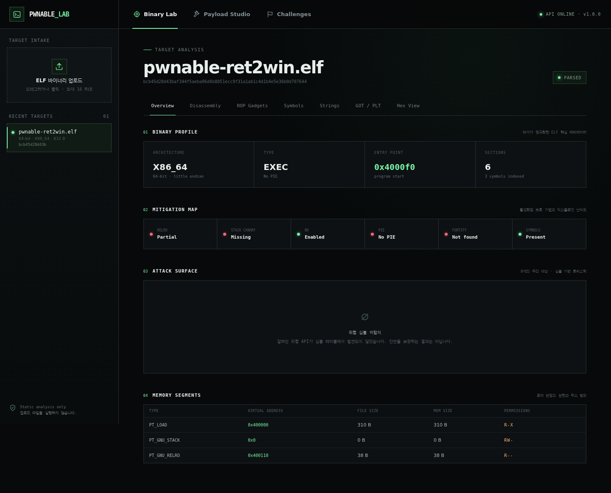
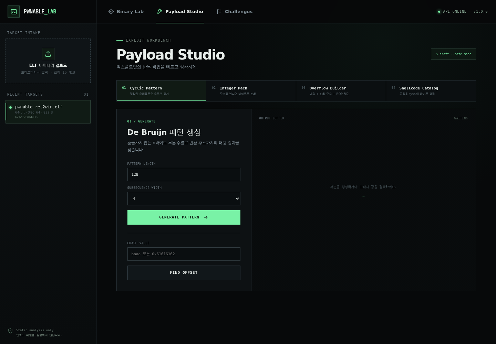
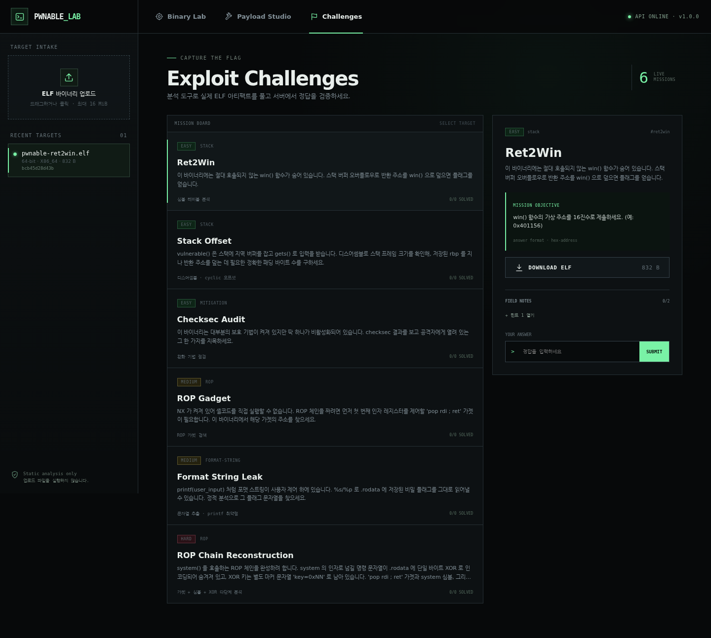

<div align="center">

# Pwnable Lab

**바이너리 익스플로잇 · 시스템 해킹 학습용 웹 플랫폼**

ELF를 업로드해 보호 기법과 공격 표면을 분석하고, ROP 가젯을 찾고, 페이로드를 조립하고,
실제 정적 바이너리 문제를 풀어봅니다.

[](https://github.com/MintKangaroo/Pwnable_Lab/actions/workflows/ci.yml)


</div>

---

## 화면

### Binary Lab

업로드한 ELF의 아키텍처·진입점·세그먼트와 RELRO, Canary, NX, PIE, Fortify를 한 화면에
정리합니다. 알려진 위험 함수는 심각도와 취약점 종류별로 분류합니다.



### Payload Studio

De Bruijn cyclic 패턴과 크래시 오프셋 검색, p32/p64 정수 패킹, 오버플로우·ROP 체인
조립, 교육용 셸코드 카탈로그를 제공합니다.



### Exploit Challenges

난이도·카테고리·힌트·다운로드 가능한 ELF 아티팩트와 서버측 정답 검증을 갖춘 6개 문제를
포함합니다.



---

## 주요 기능

### ELF 정적 분석

| 분석 | 내용 |
|---|---|
| **Header / Sections / Segments** | 비트 수, 엔디언, 머신, ELF 타입, 진입점, 권한과 주소 |
| **Checksec** | RELRO, Stack Canary, NX, PIE, RPATH, RUNPATH, Fortify, stripped |
| **Attack Surface** | `gets`, `strcpy`, `printf`, `system`, `free` 등 위험 심볼 분류 |
| **Disassembly** | Capstone 기반 x86/x86-64 선형 디스어셈블 |
| **ROP Gadgets** | 실행 섹션의 `ret` 종결 가젯 탐색과 명령 부분 검색 |
| **Symbols / Strings** | 정적·동적 심볼, ASCII·UTF-16LE 문자열 검색 |
| **GOT / PLT** | 링크 섹션 주소·권한과 정의되지 않은 동적 임포트 |
| **Hex View** | 파일 전체를 보내지 않는 512바이트 페이지 뷰 |

### 페이로드 도구

- pwntools와 같은 De Bruijn `cyclic` / `cyclic_find`
- 32/64비트 little·big endian 정수 패킹
- `[padding][return target][ROP chain…]` 페이로드 생성과 hexdump
- amd64/i386 syscall 셸코드 정적 참조 카탈로그

### 실습 문제

| Slug | 제목 | 난이도 | 연습 기술 |
|---|---|---|---|
| `ret2win` | Ret2Win | Easy | 심볼 테이블, No PIE 주소 |
| `offset-hunt` | Stack Offset | Easy | 프롤로그, 스택 프레임, cyclic |
| `checksec-audit` | Checksec Audit | Easy | 완화 기법 판정 |
| `gadget-hunt` | ROP Gadget | Medium | `pop rdi ; ret` 탐색 |
| `format-flag` | Format String Leak | Medium | 문자열, 포맷 스트링 |
| `rop-chain` | ROP Chain Reconstruction | Hard | 가젯, 심볼, XOR 데이터 복원 |

각 문제는 슬러그 기반 고정 시드로 생성되므로 서버 재시작 뒤에도 바이너리와 정답이 같습니다.
정답과 풀이는 클라이언트 응답에 포함되지 않으며, 제출 값은 서버에서 상수 시간 비교합니다.

---

## 시작하기

### 요구 사항

- Python 3.10+
- Node.js 20.19+ 또는 22+

### 백엔드

```bash
cd backend
python3 -m venv .venv
source .venv/bin/activate
pip install -e ".[dev]"
uvicorn pwnable_lab.api.app:app --reload --port 8000
```

API 문서는 [http://localhost:8000/api/docs](http://localhost:8000/api/docs)에서 볼 수 있습니다.
설정은 `PLAB_` 접두사 환경변수로 바꿀 수 있으며 전체 예시는
[`backend/.env.example`](backend/.env.example)에 있습니다.

### 프런트엔드

```bash
cd frontend
npm ci
npm run dev
```

브라우저에서 [http://localhost:5173](http://localhost:5173)을 엽니다. 개발 서버는 `/api`를
`127.0.0.1:8000`으로 프록시합니다. 다른 백엔드는 다음처럼 지정합니다.

```bash
VITE_API_TARGET=http://host:8000 npm run dev
```

### Docker Compose

```bash
docker compose up --build
```

[http://localhost:8080](http://localhost:8080)에서 Nginx 정적 프런트엔드와 FastAPI
백엔드를 함께 사용합니다. SQLite DB와 업로드 파일은 `pwnable-data` 볼륨에 유지됩니다.

---

## API

모든 경로는 `/api` 아래에 있습니다. 바이너리는 SHA-256으로 식별됩니다.

| 메서드 | 경로 | 설명 |
|---|---|---|
| `GET` | `/health` | 상태와 버전 |
| `POST` | `/binaries` | ELF 업로드 |
| `GET` | `/binaries` | 업로드 목록 |
| `GET` | `/binaries/{sha}/info` | 헤더·섹션·심볼·세그먼트 |
| `GET` | `/binaries/{sha}/checksec` | 보호 기법 |
| `GET` | `/binaries/{sha}/vulns` | 위험 함수 |
| `GET` | `/binaries/{sha}/gadgets?q=` | ROP 가젯 |
| `GET` | `/binaries/{sha}/got` | GOT/PLT와 임포트 |
| `GET` | `/binaries/{sha}/strings` | 문자열 |
| `GET` | `/binaries/{sha}/disassembly` | 디스어셈블리 |
| `GET` | `/binaries/{sha}/hex?page=` | 페이지 단위 hex |
| `POST` | `/payload/cyclic` | cyclic 패턴 |
| `POST` | `/payload/cyclic/find` | cyclic 오프셋 |
| `POST` | `/payload/pack` | 정수 패킹 |
| `POST` | `/payload/overflow` | 페이로드 조립 |
| `GET` | `/payload/shellcode` | 셸코드 카탈로그 |
| `GET` | `/challenges` | 공개 문제 메타데이터 |
| `GET` | `/challenges/{slug}/artifact` | 문제 ELF |
| `POST` | `/challenges/{slug}/submit` | 정답 검증 |

예시:

```bash
SHA=$(curl -s -F file=@./target http://localhost:8000/api/binaries | jq -r .sha256)
curl -s "http://localhost:8000/api/binaries/$SHA/checksec" | jq
curl -s "http://localhost:8000/api/binaries/$SHA/gadgets?q=pop%20rdi" | jq
```

---

## 아키텍처

```text
 React UI  ──HTTP──▶  FastAPI
                         │
        ┌────────────────┼───────────────────┐
        ▼                ▼                   ▼
  ELF parser        Analysis core       Payload tools
  (pyelftools)      checksec / scan      cyclic / pack
        │            Capstone / ROP       overflow / catalog
        │                │
        └────────┬───────┘
                 ▼
       normalized ElfImage
                 │
        ┌────────┴──────────┐
        ▼                   ▼
  Challenge registry   Binary repository
  6 seeded generators  SQLite + SHA-256 files
```

자세한 설계와 신뢰 경계는 [`docs/ARCHITECTURE.md`](docs/ARCHITECTURE.md), 단계별 사용법은
[`docs/USAGE.md`](docs/USAGE.md)를 참고하세요.

## 프로젝트 구조

```text
Pwnable_Lab/
├── backend/
│   ├── pwnable_lab/
│   │   ├── analyzer/       # checksec, disasm, gadgets, strings, vuln scan
│   │   ├── api/            # FastAPI app, routes, schemas, services
│   │   ├── challenge/      # 6개 문제 생성기와 채점
│   │   ├── database/       # SQLAlchemy repository
│   │   ├── elf/            # 정규화 파서와 최소 ELF 빌더
│   │   └── payload/        # cyclic, pack, shellcode
│   ├── tests/              # 57개 테스트
│   └── pyproject.toml
├── frontend/
│   └── src/
│       ├── components/     # Binary Lab, Payload Studio, Challenges
│       ├── api.js
│       └── styles.css
├── docs/
├── docker-compose.yml
└── Makefile
```

---

## 테스트

```bash
cd backend
pytest
pytest --cov=pwnable_lab --cov-report=term-missing

cd ../frontend
npm ci
npm run build
npm audit
```

현재 결과:

- 백엔드 **57 tests passing**
- Python 분석 코어·API **97% statement coverage**
- React 프로덕션 빌드 성공
- npm audit **0 vulnerabilities**

GitHub Actions가 push와 pull request마다 백엔드 테스트·커버리지, 프런트엔드 빌드·감사를
실행합니다.

## 보안 설계와 한계

- 업로드 파일을 **절대 실행하지 않는** 정적 분석 전용 구조
- 스트리밍 업로드 상한(기본 16 MiB)과 ELF 매직 화이트리스트
- 디스어셈블 명령 수, 가젯 수/깊이, 문자열 수, hex 페이지, cyclic 길이 제한
- 바이너리를 사용자 파일명 대신 SHA-256으로 저장해 경로 조작 차단
- 중복 파일을 원자적으로 재사용하며 정답은 서버에서만 보관
- ELF 헤더 분석은 여러 아키텍처에 적용할 수 있지만 디스어셈블·ROP는 현재 x86/x86-64 전용
- 위험 함수 탐지는 심볼 기반 휴리스틱이며 취약점 존재 여부를 확정하지 않음
- 합성 문제 ELF는 정적 분석 학습 아티팩트이며 운영체제에서 실행하는 용도가 아님

> 이 프로젝트는 교육, CTF, 소유한 시스템 또는 명시적으로 허가받은 보안 테스트를 위한
> 도구입니다. 허가 없이 타인의 시스템을 공격하는 데 사용하지 마세요.

## 라이선스

[MIT](LICENSE) © 2026 MintKangaroo
