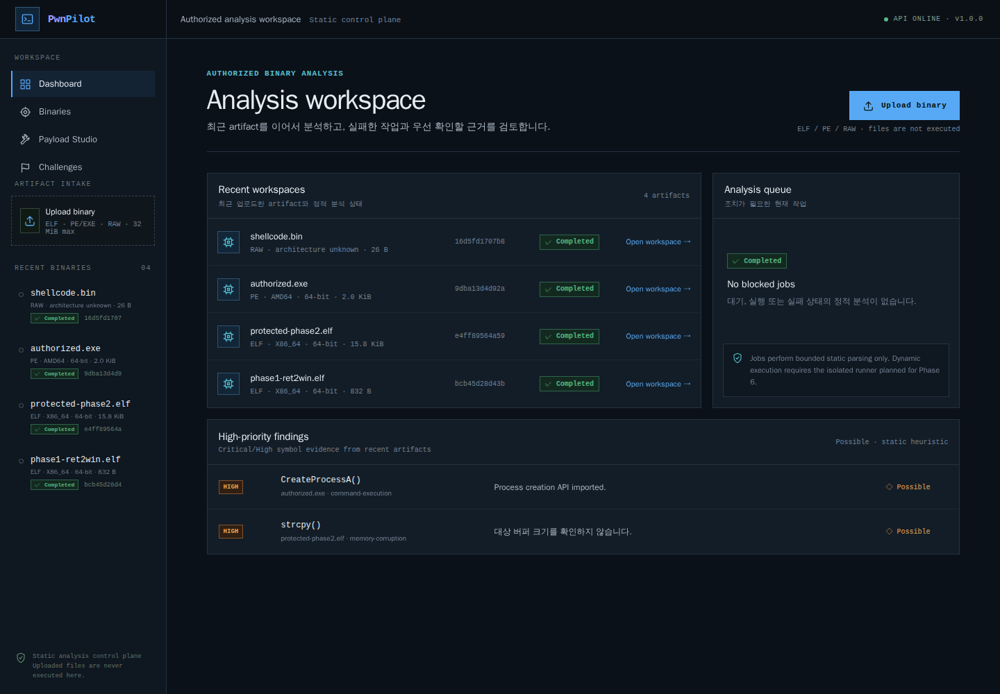
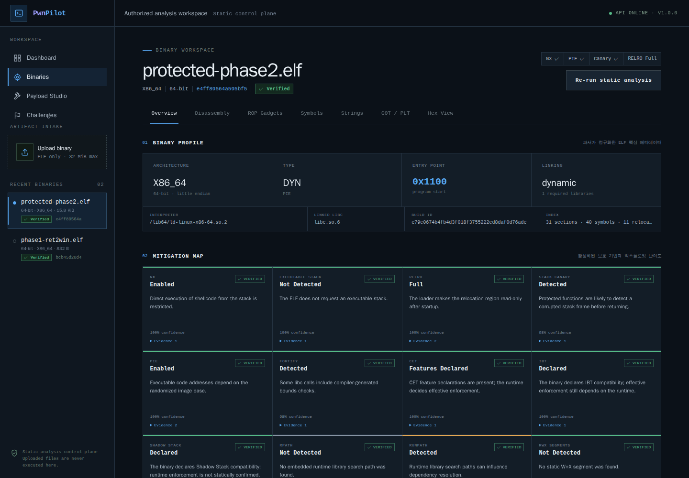
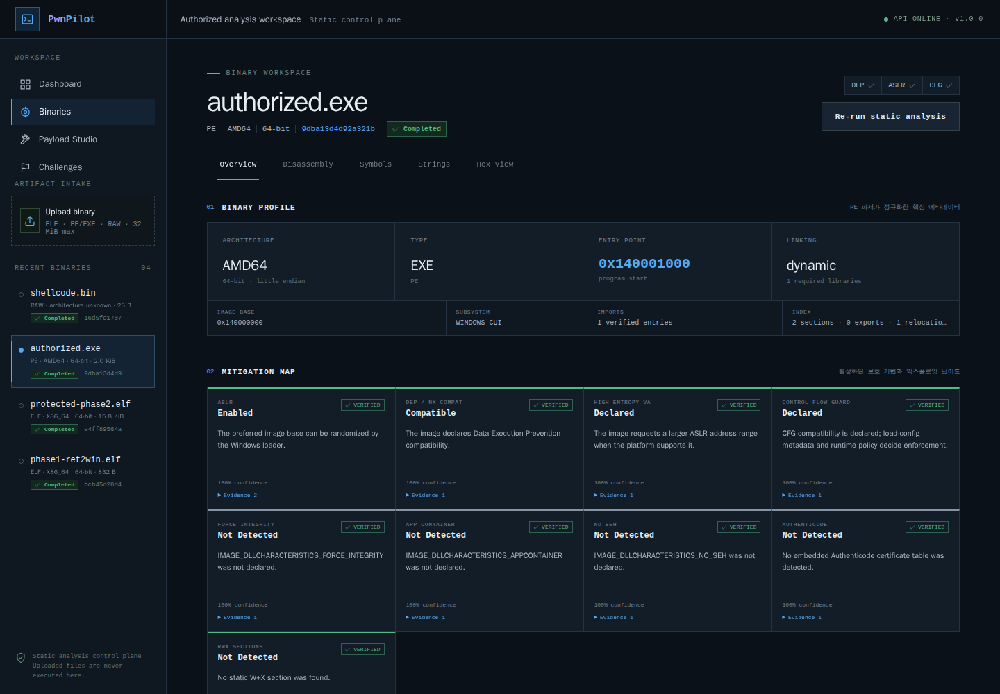
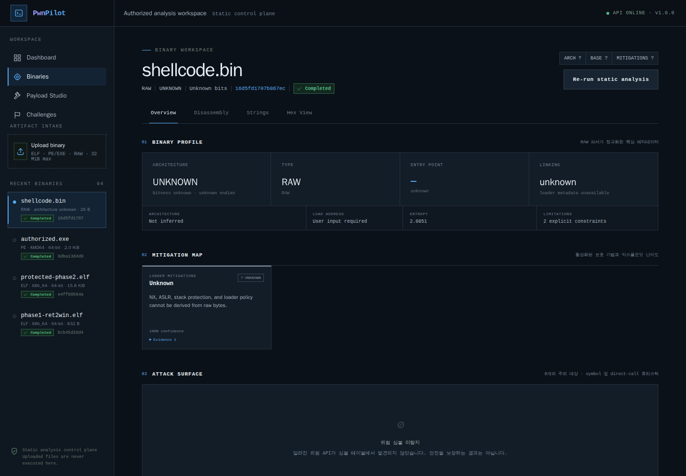
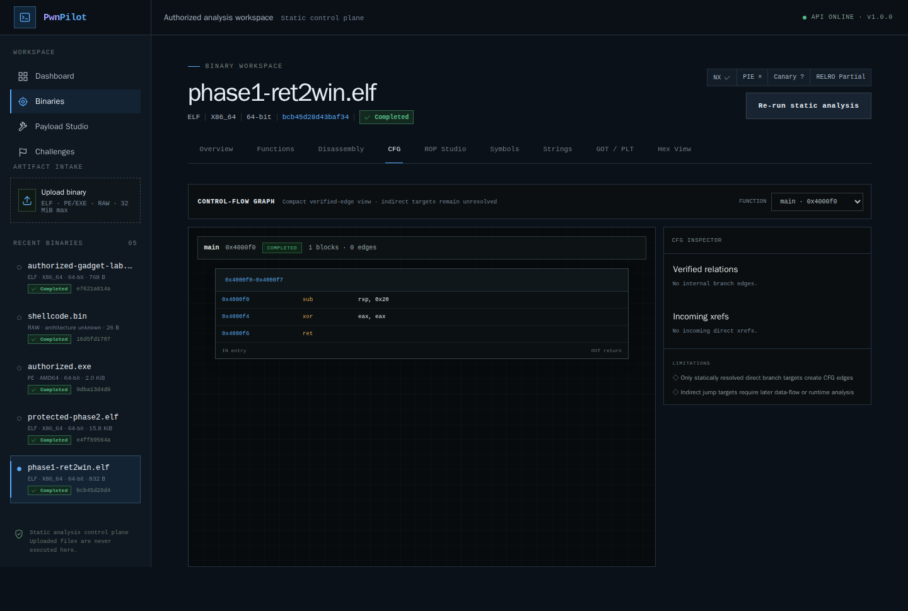
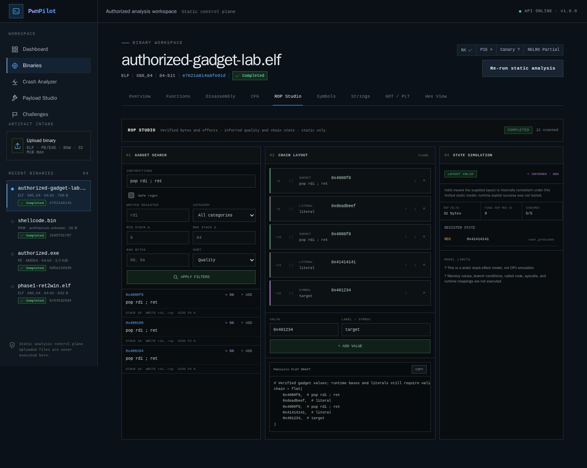
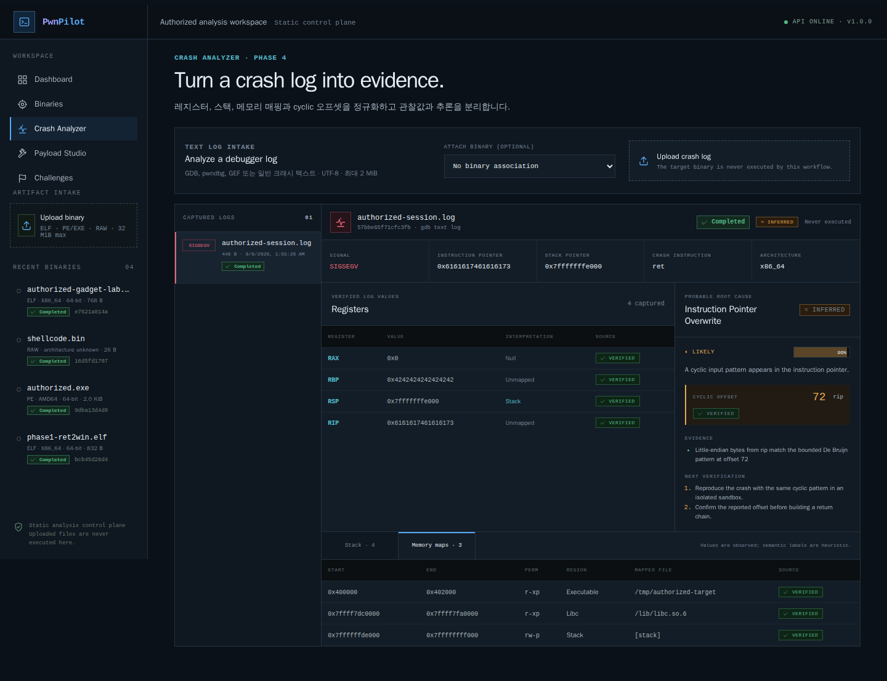

<div align="center">

# PwnPilot

**교육·CTF·허가된 바이너리를 위한 웹 기반 Pwnable 분석 워크스페이스**

[](https://github.com/MintKangaroo/Pwnable_Lab/actions/workflows/ci.yml)


</div>

PwnPilot은 ELF, Windows PE/EXE, raw binary의 구조와 보호 기법, 공격 표면,
디스어셈블리 재료를 한 Workspace에서 검토하는 교육용 분석 플랫폼입니다.
정적 분석은 업로드한 바이너리를 웹/API 호스트에서 실행하지 않습니다.
동적 익스 검증(Phase 6 auto-exploit sandbox)은 **기본 비활성**이며, 명시적으로
켠 경우에만 network-disabled 일회용 컨테이너 안에서 바이너리를 실행합니다
([`docs/AUTO_EXPLOIT_SANDBOX.md`](docs/AUTO_EXPLOIT_SANDBOX.md)).

> 교육용 CTF, 사용자가 소유한 바이너리, 명시적으로 허가받은 보안 분석에만 사용하세요.
> 임의 인터넷 표적 탐색, 스캔, 대량 공격 기능은 프로젝트 범위가 아닙니다.

### Dashboard



### Binary Overview



### Windows PE/EXE Overview



### Raw Binary Overview



### Function CFG Workspace



### ROP Studio



### Crash Analyzer



## 5분 빠른 시작

가장 간단한 방법은 Docker Compose입니다. Docker와 Compose v2만 있으면 됩니다.

```bash
git clone https://github.com/MintKangaroo/Pwnable_Lab.git
cd Pwnable_Lab
cp .env.example .env
```

`.env`에서 `POSTGRES_PASSWORD`를 로컬 개발용 값으로 바꾼 뒤 실행합니다.

```bash
docker compose up --build -d
```

- PwnPilot UI: [http://localhost:8080](http://localhost:8080)
- API health: [http://localhost:8080/api/v1/health](http://localhost:8080/api/v1/health)
- 종료: `docker compose down`

## 사용 방법

1. Dashboard의 **Upload binary**를 눌러 ELF, PE/EXE, raw binary를 선택합니다.
2. 업로드가 완료되면 정적 분석이 자동 시작됩니다.
3. **Overview**에서 포맷 identity, 보호 기법, 근거, confidence, 위험 API 후보를 확인합니다.
4. **Functions**에서 검증된 시작점과 추론된 경계를 구분하고 **CFG**에서 기본 블록,
   direct branch edge, xref를 확인합니다.
5. ELF에서는 **ROP Studio**에서 검증된 gadget을 필터링하고 정적 stack/register
   모델로 chain layout을 점검합니다.
6. **Disassembly**, **Symbols**, **Strings**, **GOT/PLT**, **Hex View**로
   필요한 근거를 더 자세히 탐색합니다.
7. 충돌 근거가 있다면 왼쪽 **Crash Analyzer**에서 GDB/pwndbg/GEF 텍스트 또는 Linux
   x86/x86-64 ELF core를 업로드합니다. RIP/RSP, stack, mappings, frame chain, cyclic
   offset과 probable root cause가 `verified`/`inferred`로 분리되어 표시됩니다.

현재 버전은 업로드한 바이너리, 크래시 로그, core dump를 **실행하지 않습니다**. Crash
Analyzer는 사용자가 제공한 텍스트와 ELF core 구조/메모리 바이트만 bounded parsing합니다.

## 지원 포맷

| 포맷 | 현재 분석 범위 | 정확성 규칙 |
|---|---|---|
| ELF32/ELF64 | headers, sections, segments, symbols, relocations, GOT/PLT, checksec, x86 disassembly/gadgets | ELF 구조 검증 후 저장 |
| PE32/PE32+ EXE/DLL | headers, sections, imports/exports, base relocations, ASLR/DEP/CFG flags, x86 disassembly | loader flag 선언과 runtime enforcement를 구분 |
| Raw binary | hash, size, entropy, strings, hex, opt-in x86/x86-64 disassembly | architecture/base address를 추측하지 않음 |

ZIP, TAR, gzip, 7-Zip, RAR 등 압축/아카이브 입력은 기본 정책상 거부됩니다.

## 현재 구현 범위

### Phase 1 foundation

- `/api/v1` FastAPI control plane과 기존 `/api` 호환 경로
- 32MiB 기본 상한의 청크 기반 업로드
- SHA-256 콘텐츠 주소 저장, deduplication, 원자적 파일 채택
- ELF magic/구조 검증, 안전한 표시 파일명, path traversal 방어
- 바이너리 목록/상세/삭제 API
- 개발용 인라인 정적 분석 작업과 `queued/running/completed/failed` 상태 API
- SQLAlchemy 2, SQLite 개발 모드, PostgreSQL Compose 모드
- 기존 DB도 업그레이드할 수 있는 Alembic migration
- React TypeScript 진입점, TanStack Query, URL 기반 Workspace
- 실제 API를 사용하는 Dashboard와 Binary Context Header
- 의미 기반 dark theme 토큰과 loading/empty/error 상태

### Phase 2 static ELF intelligence

- interpreter, `DT_NEEDED`, linked libc, Build ID, RPATH/RUNPATH, static/dynamic linking
- static/dynamic/import/export/function symbol 분류와 pagination
- relocation 정규화 및 verified GOT target
- section entry layout에서 파생한 inferred PLT stub과 confidence/evidence
- NX, executable stack, RELRO, Canary, PIE, Fortify, CET, IBT, Shadow Stack,
  RWX, stripping, linking별 상태·근거·영향·전략·신뢰도
- x86/x86-64 direct call 탐지와 제한적인 register/stack argument 추정
- 실제 GCC 생성 PIE/Full RELRO/Canary/Fortify/CET 및 static fixture 회귀 테스트

### Format-aware static intake

- MIME/파일명을 신뢰하지 않는 ELF/PE/raw 탐지
- PE32/PE32+ section, import, export, base relocation, subsystem, image base
- PE ASLR, DEP/NX Compat, High Entropy VA, CFG, Authenticode table 근거
- raw binary의 format-neutral entropy, strings, hex
- raw disassembly는 `x86`/`x86_64`와 base address를 명시한 경우에만 실행
- malformed PE, 일반 텍스트, archive signature 거부

### Phase 3 static control-flow increment

- ELF/PE x86·x86-64 실행 영역을 공통 code-region 모델로 정규화
- symbol/export/entry 기반 verified function start와 direct-call 기반 inferred start 분리
- 유효한 symbol size만 verified boundary로 사용하고 나머지 경계는 inferred 표시
- 함수별 명령, basic block, predecessor/successor, conditional edge, call target
- direct call/jump와 RIP-relative memory reference xref
- URL의 `address` 상태를 Functions, CFG, Disassembly 사이에서 유지
- `ret`, `ret imm`, `syscall`, `int 0x80` 종결 gadget의 exact-byte scan
- stack delta, register read/write, memory side effect, PIE offset, quality metadata
- safe-regex/register/category/stack/bad-byte/address filter와 pagination
- drag/reorder chain layout, inferred stack/register model, pwntools `flat` draft

### Phase 4 crash artifact increment

- GDB, pwndbg, GEF, 일반 UTF-8 크래시 로그의 bounded/non-executing intake
- signal, fault address, x86/x86-64 registers, current instruction 정규화
- GDB `x/` stack dump와 `info proc mappings`/`/proc/maps` 파싱
- stack/heap/libc/loader/executable/anonymous pointer 영역 분류
- RIP/EIP/stack 값의 bounded De Bruijn 일치와 cyclic offset 근거
- return-address/canary 후보는 확정값이 아닌 inferred heuristic으로 표시
- probable root cause는 `possible`/`likely`와 verification/confidence를 분리
- crash artifact/analysis persistence, audit, reanalysis와 paginated stack/maps API
- 실제 API 기반 Crash Analyzer workspace와 Playwright 사용자 흐름
- Linux x86/x86-64 `ET_CORE`, `PT_NOTE`, `PT_LOAD`의 bounded/non-executing intake
- `NT_PRSTATUS`, `NT_SIGINFO`, `NT_PRPSINFO`, `NT_FILE`과 다중 thread 정규화
- core memory 기반 instruction decode, stack 값, verified mapping과 inferred frame chain
- SHA-256 content-addressed core 저장, 재분석, 마지막 참조 삭제 시 파일 정리

### Phase 5 exploit strategy 1차

- checksec, 위험 API 스캔, win/셸 함수 심볼, 문자열, GOT/PLT, ROP gadget 근거를 종합한
  후보 공격 경로(ret2win, ret2system, format-string, ret2shellcode, ROP chain)
- 경로별 선행 조건(충족 여부), 진행 순서, 차단 요인, 근거와 confidence를 분리 제시
- win 함수 주소, `/bin/sh` 문자열, `pop rdi ; ret` gadget, `[rbp-N]` 버퍼에서 오프셋을
  추정해 채운 pwntools 스켈레톤 초안 (오프셋/주소는 사용자 검증 필요)
- 함수 단위 규칙 기반 pseudo-C 초안: 호출·인자, 문자열 리터럴, `if/goto`, 반환, 프레임
  크기를 근사 (진짜 디컴파일러가 아니며 결과는 inferred)
- 모든 결과는 취약점을 확정하지 않고 정적 근거만 사용하며 바이너리를 실행하지 않음

### Phase 6 auto-exploit sandbox (opt-in, 기본 비활성)

정적 전략의 **추정**을 넘어 격리 샌드박스에서 **실제 실행으로 검증**하는 동적
파이프라인. 신뢰할 수 없는 바이너리를 실행하므로 `PLAB_SANDBOX_EXECUTION_ENABLED`
로 명시적으로 켜야 하며, 프로덕션에서는 `PLAB_SANDBOX_EXECUTOR=container` 로
network-disabled 일회용 컨테이너(`--network none --read-only --cap-drop ALL
--cap-add SYS_PTRACE …`, 선택적으로 gVisor)에서만 실행합니다. 상세는
[`docs/AUTO_EXPLOIT_SANDBOX.md`](docs/AUTO_EXPLOIT_SANDBOX.md).

- **오프셋 확정**: cyclic 주입 → 크래시 관측 → `RIP`/스택 반환 슬롯에서
  `cyclic_find` 로 반환 오프셋을 `verified` 로 확정 (정적 추정이 실패하는 gcc
  간접 버퍼 관용구도 커버)
- **auto-exploit**: 정적 전략 + 동적 확정 오프셋을 pwntools 스켈레톤에 주입하고,
  ret2win(정렬 재시도) → ret2system(pop rdi→/bin/sh→system 자동 구성) →
  **execve syscall ROP**(system 없는 정적 링크: pop rdi/rsi/rdx/rax + `/bin/sh` +
  syscall 로 `execve("/bin/sh",0,0)` 구성) 순서로 **무입력 자동 검증**
- **i386(32-bit) 자동 익스**: 32-bit tracee 도 x86-64 호스트 ptrace 로 관측(EIP→RIP
  슬롯 매핑)해 오프셋을 확정하고, cdecl ret2system(스택 인자라 pop 가젯 불필요)으로
  셸을 증명. SysV i386 16바이트 스택 정렬을 `ret` 가젯 0~3개로 맞춤(amd64 movaps
  함정의 i386 판)
- **PIE 자동 익스(ret2win-pie / ret2system-pie / execve-pie, amd64·i386)**: PIE(ET_DYN)는
  로드 base 를 **로컬 관측**(ASLR-off, `personality`+`/proc/pid/maps`)해 win/system/execve
  체인을 rebase 한 뒤 같은 조건에서 셸/제어 이전을 증명 — auto-exploit 이 PIE·amd64면
  비 PIE 와 같은 순서로 ret2win-pie → ret2system-pie → execve-pie 로 자동 폴백해 셸을
  증명. **i386(32-bit) PIE 도 동일 base 관측 인프라로 cdecl ret2system-pie 지원**(정렬은
  rebase 한 `ret` 0~3개로). 정직성: base 가 로컬 관측이라 *로컬* 익스 가능성 증명이며
  원격 ASLR 우회가 아님(`aslr="disabled-for-local-proof"` 명시)
- **PIE 진짜 in-band leak(포맷스트링, `auto-fmt-leak`)**: 위 PIE 경로가 base 를 로컬
  관측하는 것과 달리, 대상이 **스스로 흘리는 포맷스트링 취약점**으로 base 를 런타임에
  복원 — **ASLR 이 켜져 있어도 성립하는 진짜 leak**(매 실행 랜덤 base 여도 셸 증명).
  샌드박스 동적 probe 로 leak 위치·오버플로 오프셋을 자체 확정하고, 2단계(leak→base
  계산→rebase 체인)로 셸을 증명(`aslr="defeated-via-inband-leak"`). 체인은 대상 재료에
  맞춰 자동 선택(win 有→ret2win, 無→**ret2system/execve** — win 없는 실전 PIE 포함).
  auto-exploit 이 단일 cyclic 확정에 실패한 PIE·amd64 에서 폴백으로 자동 시도
- **완성 pwntools 스크립트 생성(`exploit_script`)**: 비 PIE 절대주소 기법(ret2win /
  ret2system / execve / i386 ret2system)이 샌드박스에서 셸 증명되면, 확정 오프셋·주소로
  로컬 `process()` ↔ 원격 `remote(HOST,PORT)` 토글이 붙은 **바로 실행 가능한** pwntools
  스크립트를 auto-exploit 응답에 함께 반환(TODO 없는 완성본, 확정값이 원격에서도 유효).
  **fmt-leak-pie 는 1단계 포맷스트링 leak→base 복원→2단계 rebase 체인의 완성 스크립트**로
  emit — 진짜 in-band leak 이라 ASLR 켜진 원격에서도 성립(remote-ready). 반면 base 를
  ASLR-off 로컬 관측하는 나머지 PIE 경로(ret2win-pie 등)는 원격 우회가 아니라 스크립트
  대신 전략 스켈레톤 유지
- **익스 검증**: 구성한 payload/ROP 체인을 실제 주입해 제어 흐름 탈취를 확인
  (마커 매치 또는 control-transfer)
- **libc leak & ret2libc**: `puts(puts@got)` 로 런타임 libc 주소를 유출하고,
  멀티스테이지 러너(출력→입력)로 libc base 계산 후 `system("/bin/sh")` 까지
  자동 구성 — libc ASLR 격파 (amd64; in-process·컨테이너 executor 모두 지원, libc
  오프셋은 실행 환경의 libc 에서 해석)
- 안전 경계: 프로세스 rlimit(CPU/AS/NPROC/FSIZE/CORE)·wall-clock 워치독·
  프로세스그룹 SIGKILL + 컨테이너 격리. 게이트/격리 마커 미충족 시 `503`
- **UI**: ELF Workspace 의 `Exploit Runner` 탭에서 auto-exploit / confirm-offset /
  libc leak / auto-ret2libc / verify-exploit 를 실행하고 결과(확정 오프셋, 주입된
  스켈레톤, 유출 libc 주소·base, **PIE 는 관측 로드 base·rebase 타깃과 "로컬 관측"
  정직성 캡션**, 그리고 **spawn 된 셸 세션 출력으로 셸 획득 증명**)를 확인. 비활성
  배포에서는 안내(503)로 처리

### Ghidra 디컴파일 백엔드 (opt-in, 기본 비활성)

규칙 기반 pseudo-C 위에 **진짜 디컴파일러(Ghidra headless)** 를 선택 백엔드로 통합.
`PLAB_GHIDRA_ENABLED=1` 로 켠 경우에만 동작하고, 없거나 실패하면 규칙 기반으로 폴백
합니다. Ghidra 는 바이너리를 **실행하지 않고** 정적 분석만 합니다(샌드박스 러너와
성격이 다름). 상세는 [`docs/GHIDRA_DECOMPILE.md`](docs/GHIDRA_DECOMPILE.md).

- **디컴파일(`decompile-ghidra`)**: `analyzeHeadless` 로 임포트·분석 후 함수별 C 를
  회수(Ghidra 12 는 PyGhidra 대신 Java post-script 사용)
- **vuln_scan/strategy 피드백(`analyze-ghidra`)**: Ghidra 가 복원한 **실제 버퍼 크기 +
  스택 프레임 레이아웃**으로 확정 스택 오버플로를 도출한다. 정적 disasm 휴리스틱이
  `-O2`/스트립에서 놓치는 것을 `gets`/`read`/`fgets` 크기 비교로 **확정**하고, 정확한
  오프셋(`= return_addr_offset − buffer_stack_offset`)을 계산해 정적 finding 을
  `ghidra_confirmed` 로 승격하고 strategy 스켈레톤에 주입(정적 추정이라 정직하게
  `offset_verification="static-ghidra"` 라벨). 실측: `char buf[64]`→72, 2-버퍼→200 이
  동적 확정값과 일치
- **UI**: ELF Workspace 의 `Ghidra` 탭에서 온디맨드로 실행해 확정 오버플로·주입 오프셋·
  승격 취약점·함수별 디컴파일 C 를 확인(비활성이면 pseudo-C 폴백 안내)

### 재사용된 정적 분석 기능

| 분석 | 현재 내용 |
|---|---|
| ELF | identity, interpreter, libraries, Build ID, sections, segments, symbol classification |
| Checksec | 근거/영향/전략/confidence가 포함된 14개 보호·링킹 항목 |
| Attack surface | 위험 symbol과 direct call 후보; 인자 추정은 inferred로 표시 |
| Disassembly | Capstone 기반 x86/x86-64 선형 디스어셈블 |
| Functions / CFG | 근거 기반 함수 경계, 기본 블록, direct edge와 xref |
| ROP | exact decode gadget metadata, semantic filter, inferred chain layout model |
| Exploit strategy | checksec·위험 API·win 함수·문자열·gadget 근거를 종합한 후보 공격 경로와 pwntools 초안 (모두 inferred) |
| Pseudo-C | 단일 함수 디스어셈블의 규칙 기반 C 유사 의사코드 (휴리스틱); 선택적으로 Ghidra headless 진짜 디컴파일 백엔드로 승격 (opt-in) |
| Strings | ASCII, UTF-16LE |
| GOT/PLT | verified relocation target과 inferred PLT stub |
| Hex | 서버 pagination 기반 512-byte page |
| Entropy | 전체 파일과 section/raw window별 Shannon entropy; 패킹 확정으로 사용하지 않음 |
| Payload tools | cyclic, cyclic find, p32/p64, overflow layout |
| Crash logs | GDB/pwndbg/GEF text, registers, stack/maps, pointer class, cyclic offset |
| Learning fixtures | 결정론적 교육용 정적 ELF 문제 6종 |

Binary Workspace를 포함한 화면은 [`docs/screenshots/`](docs/screenshots)에 있습니다.

## 기술 스택

- Backend: Python 3.12, FastAPI, Pydantic v2, SQLAlchemy 2, Alembic
- Database: SQLite 또는 PostgreSQL
- Queue: 개발용 인라인 정적 분석 큐; Redis worker는 후속 Phase
- Analysis: pyelftools, dependency-free bounded PE parser, Capstone
- Frontend: React 19, TypeScript, Vite, TanStack Query, React Router
- Runtime: Docker Compose, Nginx
- Quality: pytest, coverage, Ruff, Black, mypy 설정, TypeScript strict

## 개발 환경 실행

### 요구사항

- Python 3.12 권장
- Node.js 20.19+ 또는 22+
- Docker Compose v2 (Compose 실행 시)

### 로컬: SQLite + 인라인 큐

```bash
python3 -m venv .venv
source .venv/bin/activate
python -m pip install -e "./backend[dev]"

cd backend
cp .env.example .env
alembic upgrade head
uvicorn pwnable_lab.api.app:app --reload --port 8000
```

다른 터미널:

```bash
cd frontend
npm ci
npm run dev
```

- UI: [http://localhost:5173](http://localhost:5173)
- OpenAPI: [http://localhost:8000/api/v1/docs](http://localhost:8000/api/v1/docs)

### Docker Compose 변형

일반 Compose 실행은 위의 [5분 빠른 시작](#5분-빠른-시작)을 따릅니다. 소스 hot reload가
필요하면 다음 개발 overlay를 사용합니다.

```bash
docker compose -f docker-compose.dev.yml up --build
```

- Vite: [http://localhost:5173](http://localhost:5173)
- API: [http://localhost:8000/api/v1/health](http://localhost:8000/api/v1/health)

운영 hardening overlay의 설정 검증:

```bash
docker compose -f docker-compose.yml -f docker-compose.prod.yml config
```

기본 Compose는 정적 분석 control plane이며 업로드 바이너리를 실행하지 않습니다.
동적 익스 검증(Phase 6)은 기본 비활성이고, 켤 경우 별도의 하드닝 일회용 샌드박스
컨테이너(`sandbox/Dockerfile`, `sandbox/run.sh`)에서만 실행됩니다
([`docs/AUTO_EXPLOIT_SANDBOX.md`](docs/AUTO_EXPLOIT_SANDBOX.md)).

## 주요 API

기본 prefix는 `/api/v1`입니다. `binary_id`는 현재 SHA-256과 같습니다.

| Method | Path | 설명 |
|---|---|---|
| `GET` | `/health` | API 상태와 버전 |
| `POST` | `/binaries` | ELF/PE/raw 스트리밍 업로드 |
| `GET` | `/binaries` | artifact 목록 |
| `GET` | `/binaries/{binary_id}` | artifact 상세와 분석 상태 |
| `DELETE` | `/binaries/{binary_id}` | artifact와 분석 작업 삭제 |
| `POST` | `/binaries/{binary_id}/analyze` | versioned 정적 분석 작업 시작 |
| `GET` | `/binaries/{binary_id}/analysis` | 최신 분석 작업 상태/결과 |
| `GET` | `/binaries/{binary_id}/info` | format-aware 정규화 정보 |
| `GET` | `/binaries/{binary_id}/elf` | Phase 2 ELF metadata 계약 |
| `GET` | `/binaries/{binary_id}/pe` | PE32/PE32+ metadata; non-PE는 거부 |
| `GET` | `/binaries/{binary_id}/checksec` | 보호 기법 |
| `GET` | `/binaries/{binary_id}/symbols` | 종류별 paginated symbol |
| `GET` | `/binaries/{binary_id}/imports` | paginated imports |
| `GET` | `/binaries/{binary_id}/exports` | paginated exports |
| `GET` | `/binaries/{binary_id}/functions` | 근거 기반 paginated function index |
| `GET` | `/binaries/{binary_id}/functions/{address}` | 함수 경계, 근거, 명령어 |
| `GET` | `/binaries/{binary_id}/functions/{address}/cfg` | basic-block CFG |
| `GET` | `/binaries/{binary_id}/xrefs` | direct call/jump xref page |
| `GET` | `/binaries/{binary_id}/relocations` | paginated relocation |
| `GET` | `/binaries/{binary_id}/libraries` | interpreter와 dependency |
| `GET` | `/binaries/{binary_id}/got` | verified GOT targets |
| `GET` | `/binaries/{binary_id}/plt` | inferred PLT entries |
| `GET` | `/binaries/{binary_id}/vulns` | 위험 symbol/direct-call 후보 |
| `GET` | `/binaries/{binary_id}/gadgets` | paginated ROP gadget metadata와 필터 |
| `POST` | `/binaries/{binary_id}/rop/simulate` | 제한된 정적 chain layout 모델 |
| `GET` | `/binaries/{binary_id}/strategy` | 근거 기반 후보 exploit 경로와 pwntools 초안 (ELF 전용) |
| `POST` | `/binaries/{binary_id}/confirm-offset` | 동적 반환 오프셋 확정 (샌드박스, 기본 비활성 → 503) |
| `POST` | `/binaries/{binary_id}/auto-exploit` | 전략 + 확정 오프셋 주입 + ret2win/ret2system/execve/PIE/i386/fmt-leak 자동 검증(셸 증명) |
| `POST` | `/binaries/{binary_id}/verify-exploit` | 구성한 payload/ROP 체인 주입으로 익스 검증 |
| `POST` | `/binaries/{binary_id}/leak` | `puts(puts@got)` 런타임 libc 주소 유출 |
| `POST` | `/binaries/{binary_id}/auto-ret2libc` | 완전 자동 2단계 ret2libc (leak→base→system, amd64; in-process·컨테이너) |
| `POST` | `/binaries/{binary_id}/auto-fmt-leak` | PIE 포맷스트링 in-band leak (base 유출→rebase ret2win→셸, ASLR 우회; 오프셋 자체 확정) |
| `GET` | `/binaries/{binary_id}/functions/{address}/pseudocode` | 함수 규칙 기반 pseudo-C 초안 |
| `POST` | `/binaries/{binary_id}/decompile-ghidra` | Ghidra headless 진짜 디컴파일 (opt-in → 비활성 시 available:false) |
| `POST` | `/binaries/{binary_id}/analyze-ghidra` | Ghidra 피드백: 확정 오버플로·정확 오프셋으로 vuln_scan/strategy 승격 (opt-in) |
| `GET` | `/binaries/{binary_id}/strings` | 문자열 |
| `GET` | `/binaries/{binary_id}/disassembly` | 디스어셈블리 |
| `GET` | `/binaries/{binary_id}/hex` | paginated hex |
| `GET` | `/binaries/{binary_id}/entropy` | 전체/region entropy |
| `POST` | `/crashes` | UTF-8 로그 또는 Linux ELF core 업로드와 bounded 분석 |
| `GET` | `/crashes` | 최근 크래시 artifact와 분석 상태 |
| `GET` | `/crashes/{crash_id}` | signal/register/stack/maps/backtrace/root-cause 분석 |
| `POST` | `/crashes/{crash_id}/analyze` | 저장된 로그/core 재분석 |
| `GET` | `/crashes/{crash_id}/registers` | 관찰된 register 값 |
| `GET` | `/crashes/{crash_id}/stack` | paginated stack entry와 추론 라벨 |
| `GET` | `/crashes/{crash_id}/mappings` | paginated process mappings |
| `GET` | `/crashes/{crash_id}/backtrace` | paginated frame-pointer chain |
| `POST` | `/payload/cyclic` | cyclic pattern |
| `POST` | `/payload/cyclic/find` | cyclic offset |
| `POST` | `/payload/pack` | 정수 packing |

예:

```bash
BINARY_ID=$(
  curl -s -F file=@./target http://localhost:8000/api/v1/binaries |
  jq -r .binary_id
)
curl -s -X POST \
  "http://localhost:8000/api/v1/binaries/$BINARY_ID/analyze" | jq
curl -s \
  "http://localhost:8000/api/v1/binaries/$BINARY_ID/analysis" | jq
```

크래시 artifact 분석:

```bash
curl -s -F file=@./gdb-crash.log \
  http://localhost:8000/api/v1/crashes | jq
# 또는: curl -s -F file=@./core http://localhost:8000/api/v1/crashes | jq
```

바이너리와 연결만 하려면 `-F binary_id="$BINARY_ID"`를 추가합니다. 연결된 바이너리도
이 요청에서 실행되지 않습니다.

## 설정

Backend 설정은 `PLAB_` prefix 환경변수로 관리합니다.

| 변수 | 기본값 | 설명 |
|---|---|---|
| `PLAB_MAX_UPLOAD_BYTES` | `33554432` | 업로드 상한 |
| `PLAB_MAX_CRASH_LOG_BYTES` | `2097152` | UTF-8 크래시 로그 상한 |
| `PLAB_MAX_CORE_DUMP_BYTES` | `67108864` | Linux ELF core 상한 |
| `PLAB_UPLOAD_CHUNK_BYTES` | `1048576` | intake read chunk |
| `PLAB_MAX_CRASH_LOG_LINES` | `100000` | 분석할 최대 로그 줄 수 |
| `PLAB_MAX_CRASH_STACK_ENTRIES` | `4096` | 보존할 최대 stack 값 수 |
| `PLAB_MAX_CORE_NOTES` | `4096` | 파싱할 최대 ELF note 수 |
| `PLAB_MAX_CORE_NOTE_BYTES` | `8388608` | ELF note description별 상한 |
| `PLAB_STORAGE_DIR` | `./_storage` | content-addressed storage |
| `PLAB_DATABASE_URL` | `sqlite:///./pwnable_lab.db` | SQLAlchemy URL |
| `PLAB_AUTO_CREATE_SCHEMA` | `true` | 로컬 편의용 create_all; Compose는 false |
| `PLAB_CORS_ORIGINS` | localhost Vite origins | 허용 origin JSON |
| `PLAB_SANDBOX_EXECUTION_ENABLED` | `false` | 동적 auto-exploit 마스터 게이트 (기본 비활성) |
| `PLAB_SANDBOX_EXECUTOR` | `inprocess` | `inprocess` 또는 `container`(프로덕션 권장) |
| `PLAB_GHIDRA_ENABLED` | `false` | Ghidra 디컴파일 백엔드 활성화 (기본 비활성) |
| `PLAB_GHIDRA_HOME` | 자동 탐지 | ghidra 설치 경로(비면 `~/.local/ghidra_*`) |
| `PLAB_JAVA_HOME` | 자동 탐지 | JDK 21+ 경로(Ghidra 12 요구) |

실제 API key, 인증 secret, 외부 서버, 운영 domain, cloud credential은 예제 값으로도
커밋하지 않습니다. [`.env.example`](.env.example)에는 placeholder만 있습니다.

## 테스트와 품질 검사

```bash
cd backend
black --check pwnable_lab tests migrations
ruff check pwnable_lab tests migrations
mypy pwnable_lab
pytest --cov=pwnable_lab --cov-report=term-missing

cd ../frontend
npm ci
npm audit --audit-level=high
npm run lint
npm run typecheck
npm run build
npm run e2e

cd ..
docker compose config
docker compose -f docker-compose.dev.yml config
docker compose -f docker-compose.yml -f docker-compose.prod.yml config
```

핵심 backend coverage gate는 90%입니다. CI는 Black, Ruff, mypy, pytest/coverage,
ESLint, Prettier, TypeScript, production build, npm high-severity audit와 Playwright
핵심 플로우를 실행합니다.

## 구조

```text
Pwnable_Lab/
├── backend/
│   ├── migrations/                 # Alembic
│   ├── pwnable_lab/
│   │   ├── artifacts/              # streaming + atomic SHA storage
│   │   ├── analyzer/               # 기존 정적 분석 코어
│   │   ├── api/                    # /api/v1 control plane
│   │   ├── challenge/              # 교육용 fixture
│   │   ├── database/               # models/repository/session
│   │   ├── elf/                    # parser/builder
│   │   ├── jobs/                   # inline queue abstraction
│   │   ├── formats/                # format detection and intake policy
│   │   ├── pe/                     # bounded PE parser/analyzer
│   │   └── payload/
│   └── tests/
├── frontend/
│   └── src/
│       ├── App.tsx                 # AppShell, Dashboard, routes
│       ├── api.ts                  # typed /api/v1 client
│       └── components/
├── docs/
├── docker-compose.yml
├── docker-compose.dev.yml
└── docker-compose.prod.yml
```

전체 목표 구조와 Phase별 경계는
[`docs/IMPLEMENTATION_PLAN.md`](docs/IMPLEMENTATION_PLAN.md), 정보 구조와 디자인 규약은
[`docs/INFORMATION_ARCHITECTURE.md`](docs/INFORMATION_ARCHITECTURE.md) 및
[`docs/DESIGN_SYSTEM.md`](docs/DESIGN_SYSTEM.md)를 참고하세요. 분석 판정 규약과 API는
[`docs/ANALYZERS.md`](docs/ANALYZERS.md), [`docs/API.md`](docs/API.md)에 정리되어 있습니다.

## 보안 제한

- 업로드 파일은 backend 호스트에서 실행하지 않습니다.
- MIME이나 사용자 파일명을 저장 경로로 신뢰하지 않습니다.
- PE는 전체 헤더/section 범위를 검증하고, raw는 텍스트/아카이브와 구분합니다.
- raw architecture, entry point, base address, memory permission은 임의로 추측하지 않습니다.
- 32MiB 누적 크기와 1MiB read chunk를 서버에서 강제합니다.
- 텍스트 크래시 로그는 별도 2MiB/100,000줄/4,096 stack-entry 상한을 적용하고 ANSI/control
  sequence를 정규화합니다.
- 검증 전 임시 파일은 실패 시 제거하고, 검증 후 SHA-256 이름으로 원자적으로 채택합니다.
- 위험 함수 결과는 symbol/direct-call heuristic이며 취약점을 확정하지 않습니다.
- 인증/사용자별 ownership/rate limit이 아직 없으므로 현재 버전을 공개 인터넷에 노출하지
  마세요.
- 동적 auto-exploit(Phase 6)은 **기본 비활성**이며, `PLAB_SANDBOX_EXECUTION_ENABLED=1`
  로 명시적으로 켠 경우에만 network-disabled 일회용 샌드박스에서 실행됩니다. 프로덕션은
  `PLAB_SANDBOX_EXECUTOR=container`(gVisor 권장)로만 노출하세요.
- Ghidra 디컴파일(opt-in)은 바이너리를 실행하지 않고 정적 분석만 하지만, 무거운
  파서 attack surface 이므로 신뢰 경계 안에서만 켜세요.
- Docker socket을 backend에 마운트하는 구조는 운영 설계로 사용하지 않습니다.

## 로드맵

- Phase 2: ELF 정적 분석과 PE/raw format-aware intake 구현 완료; 데이터 흐름 정밀화 지속
- Phase 3: 함수/CFG/direct xref와 ROP Studio 1차 구현 완료; 간접 분기·고급 gadget 진행
- Phase 4: 텍스트 GDB/pwndbg/GEF 및 Linux ELF core register/stack/maps/cyclic 분석,
  frame-pointer backtrace 1차 완료; snapshot diff 후속
- Phase 5: 근거 기반 exploit strategy와 pwntools draft, 규칙 기반 pseudo-C 1차 구현 완료;
  libc leak/ASLR 흐름과 자동 오프셋 정밀화는 후속
- Phase 6 auto-exploit sandbox: **구현 완료(opt-in)** — network-disabled 일회용
  샌드박스에서 오프셋 자동 확정 후 ret2win/ret2system/execve/ret2libc, i386 ret2system,
  PIE(ret2win/ret2system/execve)-pie, 포맷스트링 in-band leak 까지 셸 획득을 자동
  증명. Ghidra 디컴파일 백엔드를 vuln_scan/strategy 에 피드백. 설계 노트:
  [`docs/AUTO_EXPLOIT_SANDBOX.md`](docs/AUTO_EXPLOIT_SANDBOX.md),
  [`docs/GHIDRA_DECOMPILE.md`](docs/GHIDRA_DECOMPILE.md). 후속: 32-bit PIE·자동 포맷스트링
  GOT overwrite·인터랙티브 원격 흐름
- Phase 6B: GDB/MI와 WebSocket interactive debugger
- Phase 6C: packing/UPX/obfuscation/runtime strings
- Phase 6D: QEMU/rr/OEP/reconstruction assistance
- Phase 7: privacy-controlled LLM provider abstraction

## 라이선스

[MIT](LICENSE) © 2026 MintKangaroo
